## Indicador Mundial

Branch => **master**

Ferramentas utilizadas:

1. FrontEnd Angular=> **v11**
2. Quarkus => **v1.11.1.Final**

## Startando aplicação

No diretório raiz do repositorio contém um arquivo `docker-compose.yml`, execute o comando abaixo, que automaticamente irá levantar
o container do frontend, e backend.

```bash
docker-compose up --build
```

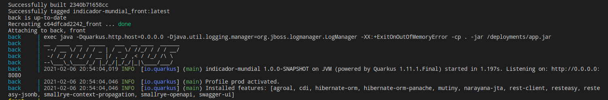

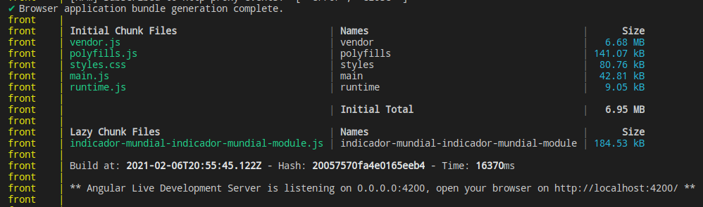

Quando finalizado, pode prosseguir com outros passos.

## Angular (frontend)

Para acessar aplicação web, acesse usando browser de sua preferência o endereço.

```
http://localhost:4200
```

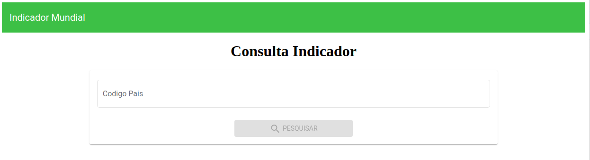

Com layout bem simples conseguimos testar algumas funcionalidades, e integrações com serviço.

Está sendo utilizando um proxy reverso entre FrontEnd e Quarkus,
o mesmo está dentro do diretório `frontend/proxy.json`.

```json
{
  "/api/*": {
    "target": "http://quarkus:8080/quarkus",
    "secure": false,
    "logLevel": "debug",
    "changeOrigin": true,
    "pathRewrite": {
      "^/api/*": ""
    }
  },
  "/quarkus/*": {
    "target": "http://quarkus:8080/quarkus",
    "secure": false,
    "logLevel": "debug",
    "changeOrigin": true,
    "pathRewrite": {
      "^/quarkus/*": ""
    }
  }
}
```

Com isso todas requisições chamando o <b>/api</b> é efetuado um rewrite para o backend.

No <b>environment.ts</b> é declarado apenas a propriedade `urlApi` com valor `api`.

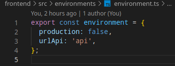

Efetuando algumas consultas no frontend temos a funcionalidade de acordo como foi solicitado.

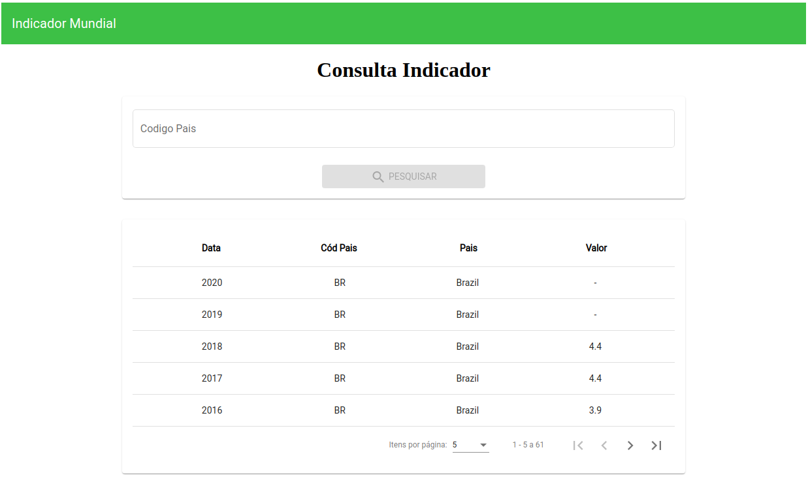

Que a mesma tem animações de pesquisa, loading de tela e consulta, paginação, tratamento de erros, e outros.

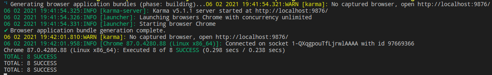

Foi adicionado alguns testes, teste de componente, html, dialogs, e requisições só para exemplo.

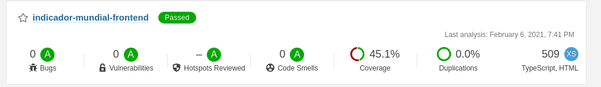
Foi passado aplicação no Code Quality também (Sonar) para demonstração.
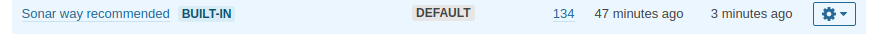
Usando o perfil que contém 134 regras de TypeScript.

## Quarkus (backend)

Para acessar a documentação de API's(Swagger) do microserviço, acesse no browser a url:

```
http://localhost:4200/api/q/swagger-ui/
```

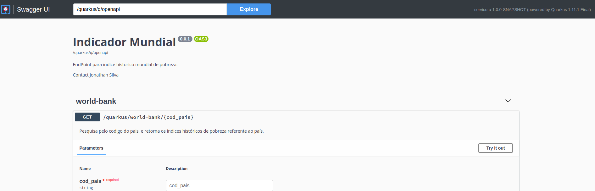

Code Quality do backend.
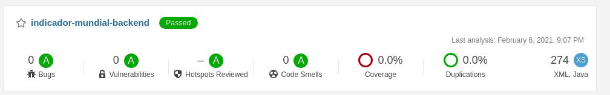

# Como navegar no app

1. No input para digitar o código do país informe algum código referente a API WorldBank, para pesquisar:
   http://api.worldbank.org/v2/country

2. Logo Depois clique em Pesquisar.
   

3. Efetuará a pesquisa, já preenchendo a tabela, e com paginação deseja pelo usuário.
   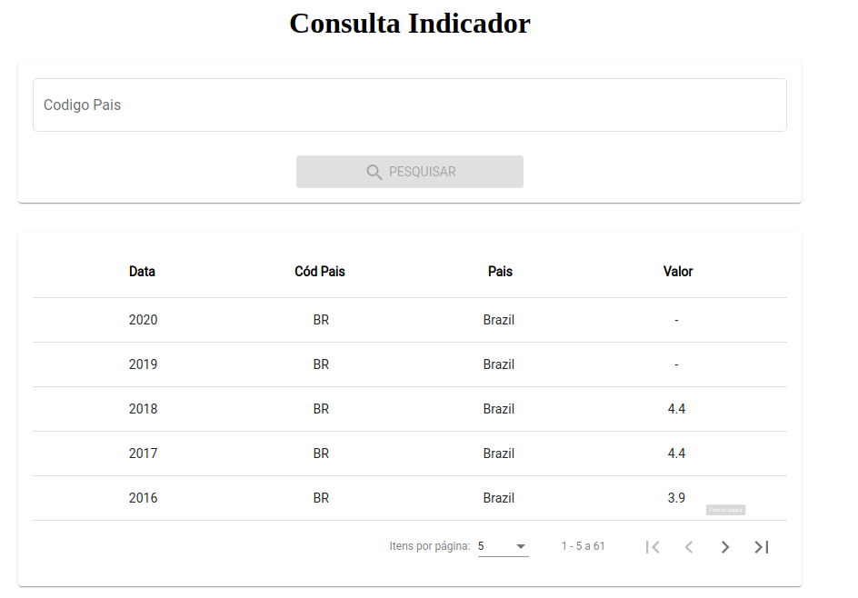

4. Caso não encontre notificara uma mensagem de erro.
   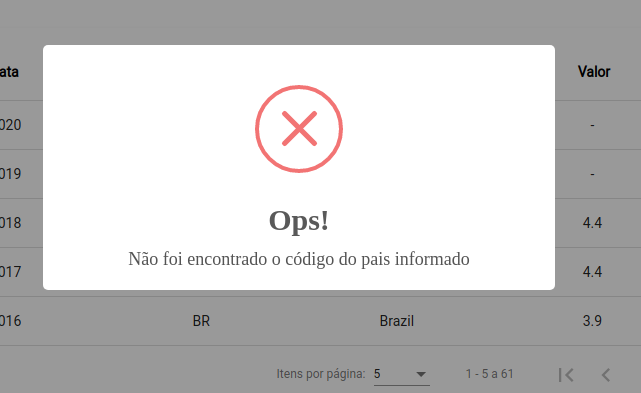

5. Também tem mensagem de erro para tratamento de erro do backend, e se o serviço estiver indisponivél.

Att.
